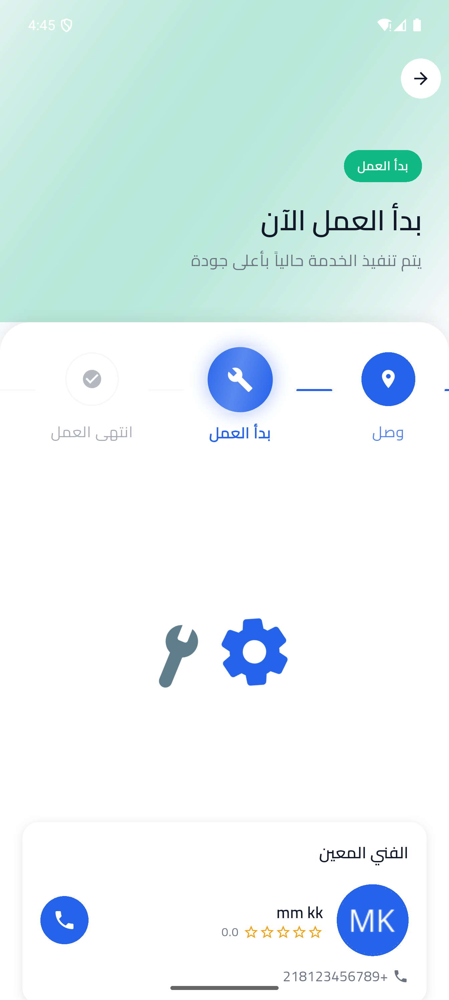
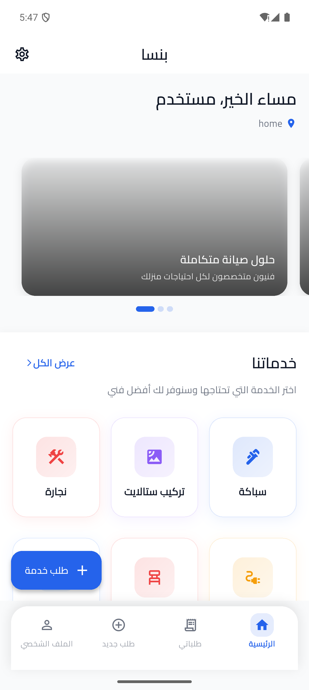

# Bensa — Mobile App (Flutter)

Customer and technician app for **Bensa**, an on-demand home services marketplace in Libya. Customers request a plumber, electrician or AC technician at their GPS location; nearby available technicians accept and the job is tracked live until it's done.

Backend (Laravel, JWT, Filament): [mobseikre/Bensa](https://github.com/mobseikre/Bensa)

<p align="center">
  
  
</p>

## Tech Stack

Flutter · Dart · REST (Dio) · JWT auth with secure token storage · Google Maps · Firebase Cloud Messaging · Geolocator

## Features

- Email + OTP sign-up, JWT login, role-based home screens (customer / technician)
- Create a request: pick category, describe the problem, drop a pin or use current location, choose priority and payment method
- Live job screen for both sides with status steps (assigned → on the way → arrived → started → done)
- Technician mode: availability toggle, background location updates, nearby-requests list sorted by distance, earnings and stats
- Ratings, notifications, saved addresses, Arabic RTL layout

## Project structure

```
lib/
├── core/           # API client, auth/session, models, error handling
├── presentation/   # screens grouped by feature (auth, requests, technician, profile)
├── routes/         # named routes and guards
├── theme/          # colors, typography, light/dark
└── widgets/        # shared components
```

## The hardest problem I solved

**Keeping the technician's location fresh without draining the battery.** The app sends location updates while the technician is available, but naive polling every few seconds killed the battery and flooded the API. I switched to distance-based updates (only send when the device has moved more than a threshold), pause updates when the technician toggles off, and debounce bursts of GPS readings. The backend uses the last known position to compute nearby requests, so a stale location silently breaks matching — handling that trade-off between freshness and cost was the core of the technician side.

## Running locally

```bash
git clone https://github.com/mobseikre/bensa_service_platform.git
cd bensa_service_platform
flutter pub get
cp env.example.json env.json      # set API_BASE_URL to your backend
flutter run --dart-define-from-file=env.json
```

Point `API_BASE_URL` at a running [Bensa backend](https://github.com/mobseikre/Bensa) (`php artisan serve` → `http://10.0.2.2:8000/api` on the Android emulator).

## What I would improve with more time

- Offline queue for status updates when the technician loses signal
- Replace location polling with a WebSocket channel
- Widget tests for the request flow
- In-app chat (backend endpoints already exist)

## License

Proprietary. Source is published for portfolio and review purposes only.
